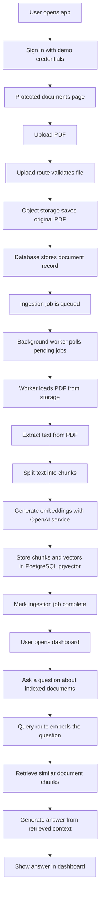
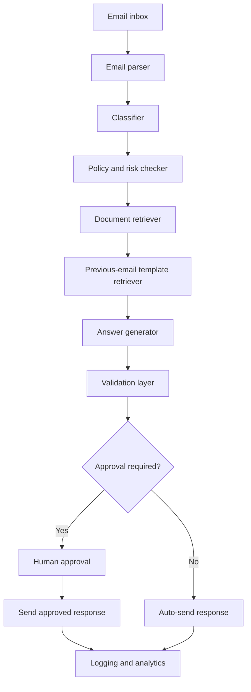

# Technical Flows

This document explains the main technical flows used by the application.

## Current PDF Document QA Flow

```mermaid
flowchart TD
    A["User opens app"] --> B["Sign in with demo credentials"]
    B --> C["Protected documents page"]
    C --> D["Upload PDF"]
    D --> E["Upload route validates file"]
    E --> F["Object storage saves original PDF"]
    F --> G["Database stores document record"]
    G --> H["Ingestion job is queued"]
    H --> I["Background worker polls pending jobs"]
    I --> J["Worker loads PDF from storage"]
    J --> K["Extract text from PDF"]
    K --> L["Split text into chunks"]
    L --> M["Generate embeddings with OpenAI service"]
    M --> N["Store chunks and vectors in PostgreSQL pgvector"]
    N --> O["Mark ingestion job complete"]
    O --> P["User opens dashboard"]
    P --> Q["Ask a question about indexed documents"]
    Q --> R["Query route embeds the question"]
    R --> S["Retrieve similar document chunks"]
    S --> T["Generate answer from retrieved context"]
    T --> U["Show answer in dashboard"]
```

# Email Reply Flow

```mermaid
flowchart TD
    A["Email inbox"] --> B["Email parser"]
    B --> C["Classifier"]
    C --> D["Policy and risk checker"]
    D --> E["Document retriever"]
    E --> F["Previous-email template retriever"]
    F --> G["Answer generator"]
    G --> H["Validation layer"]
    H --> I{"Approval required?"}
    I -- "Yes" --> J["Human approval"]
    J --> K["Send approved response"]
    I -- "No" --> L["Auto-send response"]
    K --> M["Logging and analytics"]
    L --> M
```