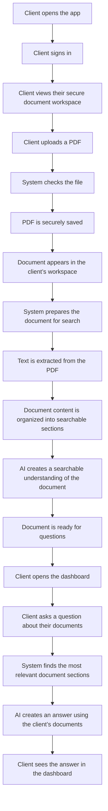
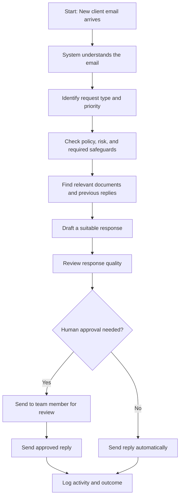

# App Core

```mermaid
flowchart TD
    A["Client opens the app"] --> B["Client signs in"]
    B --> C["Client views their secure document workspace"]
    C --> D["Client uploads a PDF"]
    D --> E["System checks the file"]
    E --> F["PDF is securely saved"]
    F --> G["Document appears in the client’s workspace"]
    G --> H["System prepares the document for search"]
    H --> I["Text is extracted from the PDF"]
    I --> J["Document content is organized into searchable sections"]
    J --> K["AI creates a searchable understanding of the document"]
    K --> L["Document is ready for questions"]
    L --> M["Client opens the dashboard"]
    M --> N["Client asks a question about their documents"]
    N --> O["System finds the most relevant document sections"]
    O --> P["AI creates an answer using the client’s documents"]
    P --> Q["Client sees the answer in the dashboard"]
```
# Email automation

```mermaid
flowchart TD
    A["Start: New client email arrives"] --> B["System understands the email"]
    B --> C["Identify request type and priority"]
    C --> D["Check policy, risk, and required safeguards"]
    D --> E["Find relevant documents and previous replies"]
    E --> F["Draft a suitable response"]
    F --> G["Review response quality"]
    G --> H{"Human approval needed?"}
    H -- "Yes" --> I["Send to team member for review"]
    I --> J["Send approved reply"]
    H -- "No" --> K["Send reply automatically"]
    J --> L["Log activity and outcome"]
    K --> L
```
