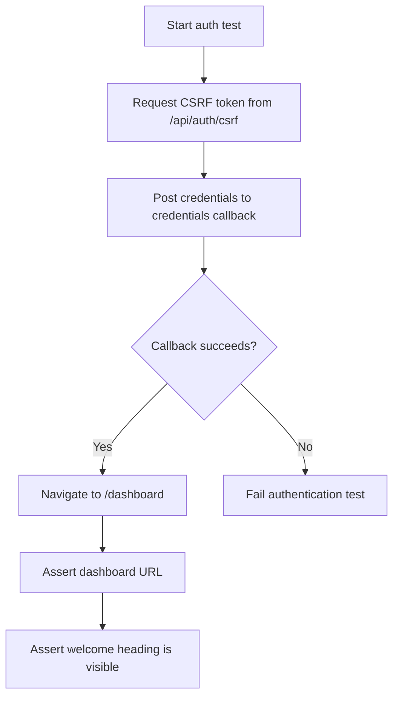
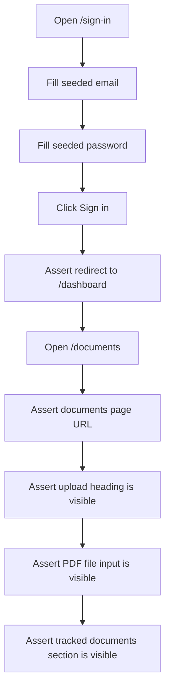
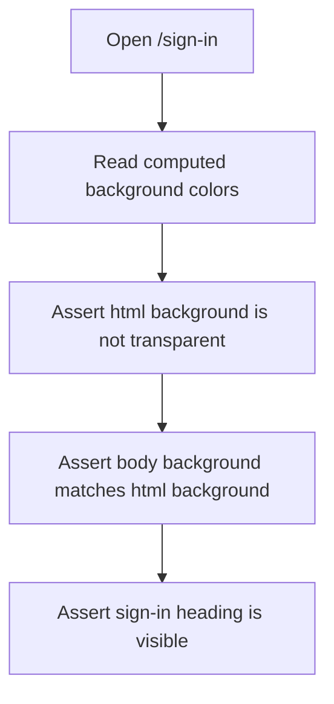
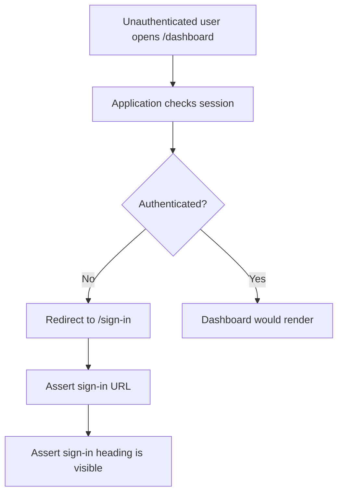
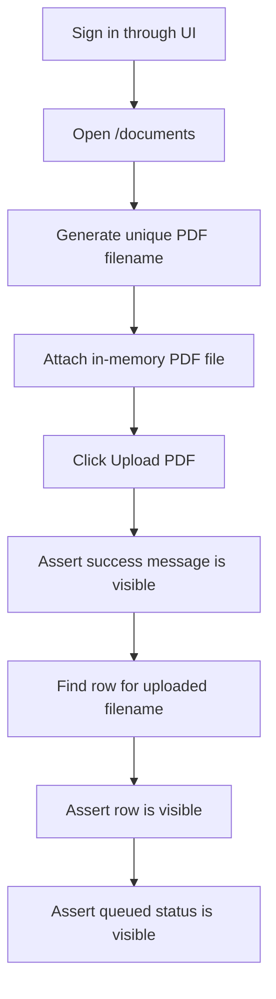
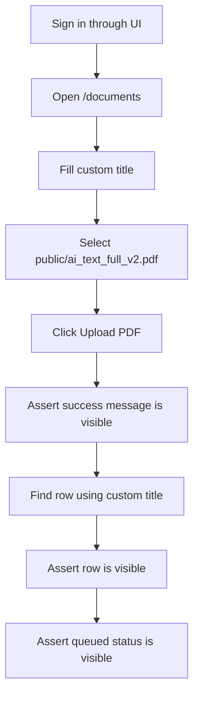
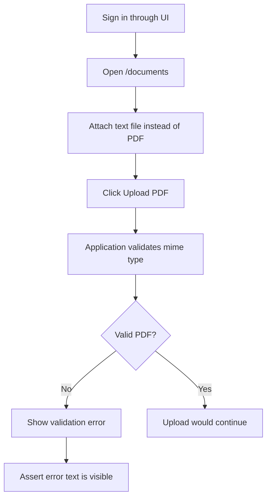

# E2E Test Flows

## API Login To Dashboard

## UI Sign-In Then Open Documents

## Sign-In Visual Regression Check

## Protected Route Redirect

## Upload Generated PDF

## Upload Existing Public PDF With Custom Title

## Reject Invalid Upload

